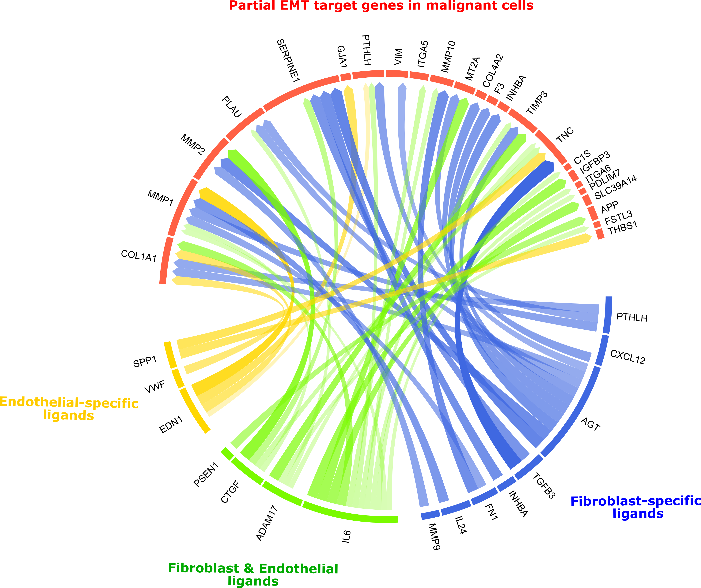

<!-- README.md is generated from README.Rmd. Please edit that file -->
<!-- github markdown built using
rmarkdown::render("README.Rmd",output_format = "md_document")
-->

nichenetr
=========

**nichenetr: the R implementation of the NicheNet method.** The goal of
NicheNet is to study intercellular communication from a computational
perspective. NicheNet uses human or mouse gene expression data of
interacting cells as input and combines this with a prior model that
integrates existing knowledge on ligand-to-target signaling paths. This
allows to predict ligand-receptor interactions that might drive gene
expression changes in cells of interest.

The NicheNet paper is now published: [NicheNet: modeling intercellular
communication by linking ligands to target
genes](https://www.nature.com/articles/s41592-019-0667-5).

Bonnardel, T’Jonck et al. already used NicheNet to predict upstream
niche signals driving Kupffer cell differentiation [Stellate Cells,
Hepatocytes, and Endothelial Cells Imprint the Kupffer Cell Identity on
Monocytes Colonizing the Liver Macrophage
Niche](https://www.cell.com/immunity/fulltext/S1074-7613(19)30368-1).

Introduction to NicheNet
------------------------

The figure below shows a graphical representation of the NicheNet
workflow. Interactions inferred from several complementary
ligand-receptor, signaling and gene regulatory data sources were
aggregated in respective integrated networks from which ligand-target
regulatory potential scores were calculated. This model of prior
information on potential ligand-target links can then be used to infer
active ligand-target links between interacting cells. NicheNet
prioritizes ligands according to their activity (i.e., how well they
predict observed changes in gene expression in the receiver cell) and
looks for affected targets with high potential to be regulated by these
prioritized ligands.

We offer the option to use the prebuilt prior model (such that the
network integration steps should not be repeated), or to create and use
your own prior model (see reference to detailed vignette below).

      

NicheNet strongly differs from most current computational approaches to
study intercellular communication. Current approaches study
intercellular communication from (single-cell) expression data by
linking ligands expressed by sender cells to their corresponding
receptors expressed by receiver cells. However, functional understanding
of a cellular communication process also requires knowing how these
inferred ligand-receptor interactions result in changes in the
expression of downstream target genes within the receiver cells. To
address this need, we developed NicheNet. Contrary to existing
approaches, NicheNet looks at gene regulatory effects of ligands because
the used prior knowledge goes beyond ligand-receptor interactions and
incorporates intracellular signaling and transcriptional regulation as
well. As a result, NicheNet allows to predict which ligands influence
the expression in another cell, which target genes are affected by each
ligand and which signaling mediators may be involved. By generating
these novel types of hypotheses, NicheNet can drive an improved
functional understanding of a cell-cell communication process of
interest. The figure below summarizes the conceptual differences between
most current ligand-receptor network inference approaches (top panel)
and NicheNet (bottom panel) and visualizes the power of NicheNet in
prioritizing ligand-receptor interactions based on gene expression
effects.

  

  

Main functionalities of nichenetr
---------------------------------

Specific functionalities of this package include:

-   assessing how well ligands expressed by a sender cell can predict
    changes in gene expression in the receiver cell
-   prioritizing ligands based on their effect on gene expression
-   inferring putative ligand-target links active in the system under
    study
-   inferring potential signaling paths between ligands and target genes
    of interest: to generate causal hypotheses and check which data
    sources support the predictions
-   validation of the prior ligand-target model
-   construction of user-defined prior ligand-target models

Moreover, we provide instructions on how to make intuitive
visualizations of the main predictions (e.g., via circos plots as shown
here below).

   

Installation of nichenetr
-------------------------

Installation typically takes a few minutes, depending on the number of
dependencies that has already been installed on your pc. You can install
nichenetr (and required dependencies) from github with:

    # install.packages("devtools")
    devtools::install_github("saeyslab/nichenetr")

nichenetr was tested on both Windows and Linux (R version 3.6.0)

Learning to use nichenetr
-------------------------

To learn using nichenetr, read one of the following vignettes explaining
several types of analyses:

Following vignette contains the explanation on how to perform the most
basic NicheNet analysis: prioritizing ligands and predicting target
genes of prioritized ligands - this demo analysis takes only a few
minutes to run:

-   [NicheNet’s ligand activity analysis on a gene set of interest:
    predict active ligands and their target
    genes](vignettes/ligand_activity_geneset.md):
    `vignette("ligand_activity_geneset", package="nichenetr")`

Following vignettes contain explanation on how to do some follow-up
analyses after performing the most basic analysis:

-   [Inferring ligand-to-target signaling
    paths](vignettes/ligand_target_signaling_path.md):
    `vignette("ligand_target_signaling_path", package="nichenetr")`
-   [Assess how well top-ranked ligands can predict a gene set of
    interest](vignettes/target_prediction_evaluation_geneset.md):
    `vignette("target_prediction_evaluation_geneset", package="nichenetr")`
-   [Single-cell NicheNet’s ligand activity
    analysis](vignettes/ligand_activity_single_cell.md):
    `vignette("ligand_activity_single_cell", package="nichenetr")`
-   [Circos plot visualization to show active ligand-target links
    between interacting
    cells](vignettes/circos.md):`vignette("circos", package="nichenetr")`.

To facilitate the use of NicheNet on single-cell data, we demonstrate
the use of NicheNet on a Seurat object in following vignettes. One
demonstrates the use of a single wrapper function, the other
demonstrates what’s behind the wrapper.

-   [Perform NicheNet analysis starting from a Seurat
    object](vignettes/seurat_wrapper.md):`vignette("seurat_wrapper", package="nichenetr")`
-   [Perform NicheNet analysis starting from a Seurat object:
    step-by-step
    analysis](vignettes/seurat_steps.md):`vignette("seurat_steps", package="nichenetr")`

People interested in building own models or benchmark own models against
NicheNet can read one of the following vignettes:

-   [Model construction](vignettes/model_construction.md):
    `vignette("model_construction", package="nichenetr")`
-   [Model evaluation: target gene and ligand activity
    prediction](vignettes/model_evaluation.md):
    `vignette("model_evaluation", package="nichenetr")`
-   [Parameter optimization via
    mlrMBO](vignettes/parameter_optimization.md):
    `vignette("parameter_optimization", package="nichenetr")`

People working with mouse data can see in the following vignette how to
convert NicheNet’s ligand-target model (given in human symbols) to mouse
symbols:

-   [Converting NicheNet’s model from human to mouse
    symbols](vignettes/symbol_conversion.md):
    `vignette("symbol_conversion", package="nichenetr")`

References
----------

Bonnardel et al., 2019, Immunity 51, 1–17, [Stellate Cells, Hepatocytes,
and Endothelial Cells Imprint the Kupffer Cell Identity on Monocytes
Colonizing the Liver Macrophage
Niche](https://doi.org/10.1016/j.immuni.2019.08.017)

Browaeys et al., 2019, Nat Methods [NicheNet: modeling intercellular
communication by linking ligands to target
genes](https://doi.org/10.1038/s41592-019-0667-5)
