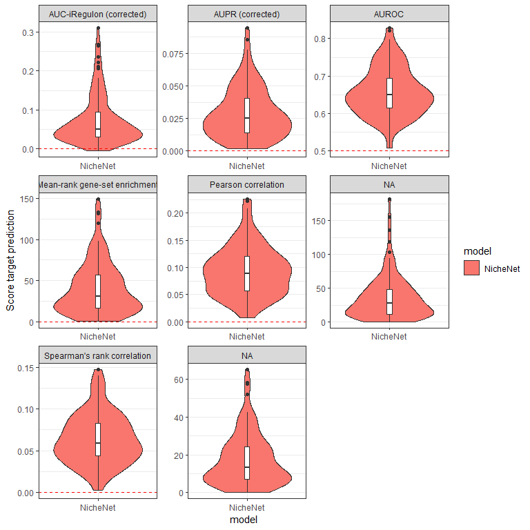
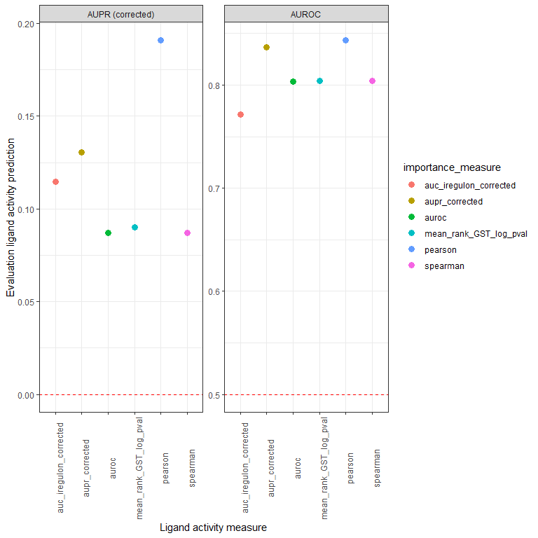

Evaluation of NicheNet’s ligand-target predictions
================
Robin Browaeys
2018-11-12

<!-- github markdown built using 
rmarkdown::render("vignettes/model_evaluation.Rmd", output_format = "github_document")
-->

This vignette shows how the ligand-target predictions of NicheNet were
evaluated. For validation, we collected transcriptome data of cells
before and after they were treated by one or two ligands in culture.
Using these ligand treatment datasets for validation has the advantage
that observed gene expression changes can be directly attributed to the
addition of the ligand(s). Hence, differentially expressed genes can be
considered as a gold standard of target genes of a particular ligand.

You can use the procedure shown here to evaluate your own model and
compare its performance to NicheNet. Ligand treatment validation
datasets and NicheNet’s ligand-target model can be downloaded from
Zenodo
[](https://doi.org/10.5281/zenodo.3260758).

### Load nichenetr, the model we want to evaluate, and the datasets on which we want to evaluate it.

``` r
library(nichenetr)
library(dplyr)
library(ggplot2)
library(tidyr)
library(purrr)
library(tibble)

# Load in the ligand-target model
ligand_target_matrix = readRDS(url("https://zenodo.org/record/3260758/files/ligand_target_matrix.rds"))

# The ligand treatment expression datasets used for validation can be downloaded from Zenodo:
expression_settings_validation = readRDS(url("https://zenodo.org/record/3260758/files/expression_settings.rds"))

#Ligand treatment datasets show the log fold change in expression of genes after treatment with one or more specific ligands. Here: example for the ligand NODAL:
head(expression_settings_validation$nodal_Nodal$diffexp)
##            lfc       qval   gene
## 1 -0.072591381 0.03767323  BEST1
## 2 -0.133032792 0.62838239 SMIM37
## 3 -0.001152079 0.98974906  CRADD
## 4 -0.018723210 0.63536958  RCAN2
## 5 -0.070250368 0.36418916 MFAP3L
## 6 -0.192244949 0.23454428   PARL
```

### Example: transcriptional response prediction evaluation

First, we will demonstrate how to evaluate the transcriptional response
(i.e. target gene prediction) performance for all ligand treatment
expression datasets. For this, we determine how well the model predicts
which genes are differentially expressed after treatment with a ligand.
Ideally, target genes with high regulatory potential scores for a
ligand, should be differentially expressed in response to that
ligand.

``` r
# Convert expression datasets to the required format to perform target gene prediction
settings = expression_settings_validation %>% lapply(convert_expression_settings_evaluation)

# For the sake of simplicity, we exclude in this vignette the ligand-treatment datasets profiling the response to multiple ligands. To see how to build a ligand-target model with target predictions for multiple ligands at once: see vignette [Construction of NicheNet's ligand-target model](vignettes/model_construction.md): `vignette("model_construction", package="nichenetr")`.
settings = settings %>% discard(~length(.$from) > 1)

# Evaluate transcriptional response prediction on every dataset
performances = settings %>% lapply(evaluate_target_prediction, ligand_target_matrix) %>% bind_rows()

# Visualize some classification evaluation metrics showing the target gene prediction performance
performances = performances %>% select(-aupr, -auc_iregulon, -sensitivity_roc, -specificity_roc) %>% gather(key = scorename, value = scorevalue, auroc:spearman)
scorelabels = c(auroc="AUROC", aupr_corrected="AUPR (corrected)", auc_iregulon_corrected = "AUC-iRegulon (corrected)",pearson = "Pearson correlation", spearman = "Spearman's rank correlation",mean_rank_GST_log_pval = "Mean-rank gene-set enrichment")
scorerandom = c(auroc=0.5, aupr_corrected=0, auc_iregulon_corrected = 0, pearson = 0, spearman = 0,mean_rank_GST_log_pval = 0) %>% data.frame(scorevalue=.) %>% rownames_to_column("scorename")

performances %>%
  mutate(model = "NicheNet") %>%
  ggplot() +
  geom_violin(aes(model, scorevalue, group=model, fill = model)) +
  geom_boxplot(aes(model, scorevalue, group = model),width = 0.05) +
  scale_y_continuous("Score target prediction") +
  facet_wrap(~scorename, scales = "free", labeller=as_labeller(scorelabels)) +
  geom_hline(aes(yintercept=scorevalue), data=scorerandom, linetype = 2, color = "red") +
  theme_bw()
```

<!-- -->

### Example: ligand activity prediction evaluation

Now we will show how to assess the accuracy of the model in predicting
whether cells were treated by a particular ligand or not. In other
words, we will evaluate how well NicheNet prioritizes active ligand(s),
given a set of differentially expressed genes. For this procedure, we
assume the following: the better a ligand predicts the transcriptional
response compared to other ligands, the more likely it is that this
ligand is active. Therefore, we first get ligand activity/importance
scores for all ligands on all ligand-treatment expression datasets of
which the true acive ligand is known. Then we assess whether the truly
active ligands get indeed higher ligand activity scores as should be for
a good ligand-target
model.

``` r
# convert expression datasets to correct format for ligand activity prediction
all_ligands = settings %>% extract_ligands_from_settings(combination = FALSE) %>% unlist()
settings_ligand_prediction = settings %>% convert_settings_ligand_prediction(all_ligands = all_ligands, validation = TRUE)

# infer ligand importances: for all ligands of interest, we assess how well a ligand explains the differential expression in a specific datasets (and we do this for all datasets).
ligand_importances = settings_ligand_prediction %>% lapply(get_single_ligand_importances,ligand_target_matrix) %>% bind_rows()

# Look at predictive performance of single/individual importance measures to predict ligand activity: of all ligands tested, the ligand that is truly active in a dataset should get the highest activity score (i.e. best target gene prediction performance)
evaluation_ligand_prediction = ligand_importances %>% evaluate_single_importances_ligand_prediction(normalization = "median")

# Visualize some classification evaluation metrics showing the ligand activity prediction performance
evaluation_ligand_prediction = evaluation_ligand_prediction %>% select(-aupr, -sensitivity_roc, -specificity_roc, -pearson, -spearman, -mean_rank_GST_log_pval) %>% gather(key = scorename, value = scorevalue, auroc:aupr_corrected)
scorelabels = c(auroc="AUROC", aupr_corrected="AUPR (corrected)")
scorerandom = c(auroc=0.5, aupr_corrected=0) %>% data.frame(scorevalue=.) %>% rownames_to_column("scorename")

evaluation_ligand_prediction %>%
 filter(importance_measure %in% c("auroc", "aupr_corrected", "mean_rank_GST_log_pval", "auc_iregulon_corrected", "pearson", "spearman")) %>%
  ggplot() +
  geom_point(aes(importance_measure, scorevalue, group=importance_measure, color = importance_measure), size = 3) +
  scale_y_continuous("Evaluation ligand activity prediction") +
  scale_x_discrete("Ligand activity measure") +
  facet_wrap(~scorename, scales = "free", labeller=as_labeller(scorelabels)) +
  geom_hline(aes(yintercept=scorevalue), data=scorerandom, linetype = 2, color = "red") +
  theme_bw() +
  theme(axis.text.x = element_text(angle = 90))
```

<!-- -->
